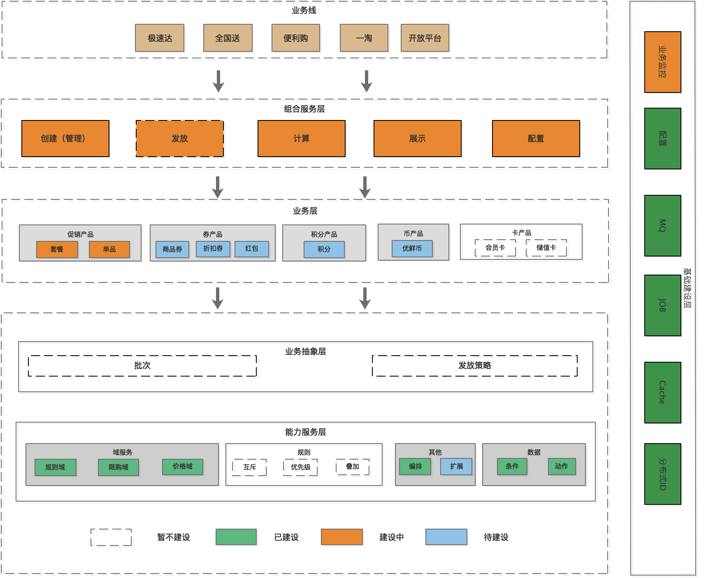

# 1 背景
&emsp;&emsp;
目前我们的营销工具比较多，玩法也比较复杂。有卡、券、积分、促销等超过5种营销工具，每一种工具包含立减、打折、赠送等玩法，每一类玩法会在不同的工具中有差异化。因此出现了各种烟囱系统。

# 2 现状

 

    
  

&emsp;&emsp;
整个营销体系现状如上图，存在如下问题：

•重复建设、重复维护、重复投资。存在开发和维护的成本，明显浪费资源。

•系统间交互集成和协作成本高，随着业务发展，各系统之间不得不开始打通，涉及到大量的协同和开发成本；

•不利于业务沉淀与持续发展。因为之前系统的设计原因，业务领域的数据和业务被打散到不同的系统中，这样无法满足业务快速响应和模式创新的需求，同时无法从更高维度上去观察和设计整个领域。

&emsp;&emsp;
总结起来就是因为业务和规则混在一起，导致耦合性强，复用性低，可扩展性低。

# 3 中台要解决的问题
1.规则褪祛业务化，统一标准化，及关系维护。

2.统一计算模型。

3.强扩展：能力编排，每个营销工具可以编排自己需要的平台层提供的能力。

4.高复用：标准模型，通用领域服务。

5.避免重复开发建设。

6.低营销产品系统之间打通协作成本。

7.利于业务沉淀发展。

8.业务和数据低耦合性。

# 4 总体架构

 

    
  

我们的建设思路面向平台建设，由平台提供可复用的能力。 总体分为业务平台和能力平台两部分。

1.业务平台：营销产品生命周期的维护及营销产品的业务场景的实现。

2.能力平台：规则的标准化和规则关系的维护，把能力按领域划分。

 

    
  

### 4.1 中台工作流程

1.业务平台把业务规则按照能力平台定义出的规则模型标准化，将规则数据同步到数据库中。

2.能力平台负责对外暴露服务，接收业务平台的请求，优惠域进行参数组装，根据业务的身份执行不同的脚本引擎，调用对应领域的服务。

3.能力平台对规则数据按照作用范围进行领域划分，如：负责计算的价格域、负责过滤的规则域等。

 

    
  

### 4.2 系统交互

1.价格计算服务：统一对外部业务系统提供营销业务服务，对内部营销业务系统提供规则服务。

2.能力平台服务系统：提供基础领域服务。

能力平台后管：提供对规则的管理维护，规则关系的维护管理。

 

    
  

### 4.3 优惠计算流程

 

    
  

#5 扩展能力
&emsp;&emsp;

能力平台要满足各种特性的业务玩法接入，通过扩展点和流程编排两种方式实现强扩展性：

1.能力扩展点：平台的现有能力无法满足业务需求时，则由产品扩展点来扩展。如，平台将四舍五入作为默认能力，但是在某些业务中，要求打折后取整，平台将这类处理逻辑在产品扩展点中实现，当这个业务计算时，平台通过该产品标识，将请求路由到扩展点执行，这样可以解决规则的定制化问题。

 

    
  

2.流程编排，通过流程编排的方式，允许业务按照场景进行自定义能力选择，实现用户自定义。

 

    
  

#6 建设路径

1.促销产品建设

  a.新促销上线。
  
  b.导购、快捷促销、智能促销、腾讯智慧零售小程序、便利购等业务方接入新的促销（组合服务层服务）。
  
  c.老促销相关系统下线。

2.券产品建设

  a.优惠券服务重构（整合），并接入能力服务。
  
  b.优惠券消费方接入新的券服务（组合服务层服务）
  
  c.老优惠券服务下线。

3.鲜币产品建设

  a.鲜币产品重构（整合），鲜币产品接入能力服务。
  
  b.鲜币消费方接入新的券服务（组合服务层服务）
  
  c.老鲜币产品下线。

4.积分产品建设

  a.积分产品重构（整合）。
  
  b.积分消费方接入新的券服务（组合服务层服务）
  
  c.老积分产品下线。

