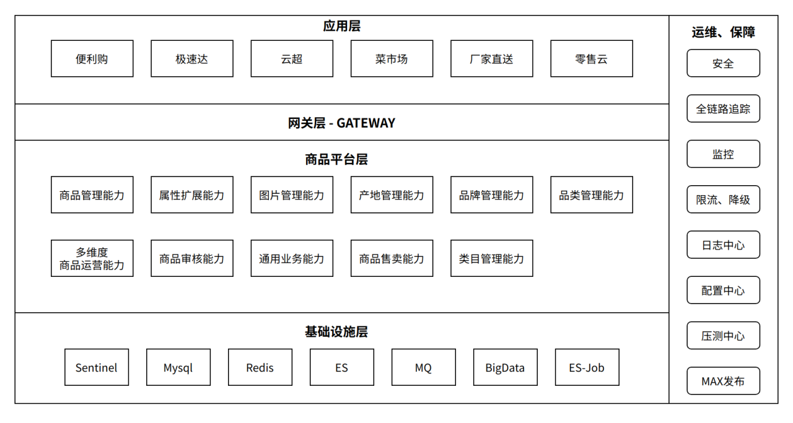
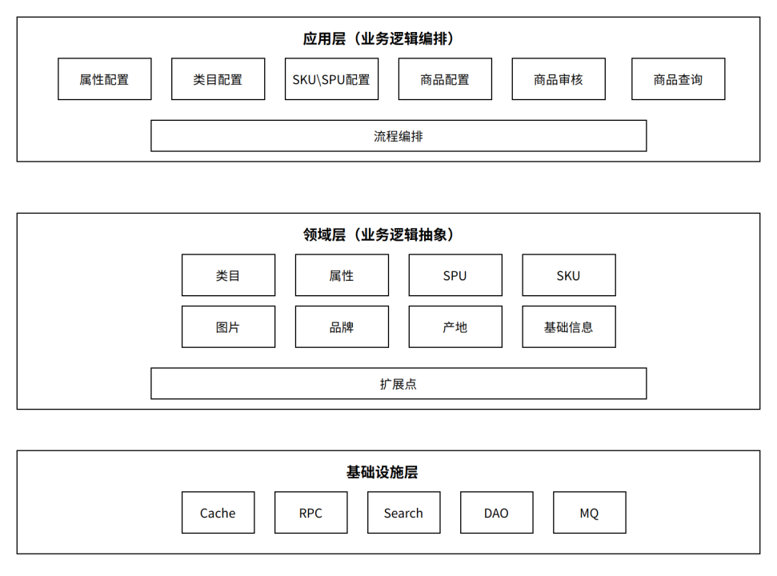

# 1 系统概述
## 1.1 背景
&emsp;&emsp;
目前我们公司内部存在便利购和主商城两套商品系统，面临着维护成本高，数据割裂，业务迭代响应慢等问题，迫切需要一套商品平台来解决以上问题。
商品平台化系统旨在通过沉淀商品基础能力、快速支持各业务线商品管理能力、商品属性扩展能力。最终构建一套通用、可配置、可扩展、可协作的商品平台，统一支持多业务、多品类的商品。

## 1.2 中台设计目标

￮商品数据统一管控，为上游各业务线提供支撑

￮支撑各个业务系统使用商品能力

￮解决商品烟囱系统重复建设问题

￮高吞吐量，查询性能 > 20000 QPS

节奏：

a.搭建商品平台基础服务能力（一期）

b.便利购商品数据接入商品平台（一期）

c.商品SPU标准化（二期）

主商城商品接入商品平台标准化、商品平台统一收敛商品管理能力（二期）

## 1.3 术语和缩略语

•SPU : SPU是商品信息聚合的最小单位。如 iPhoneX 就是SPU

•CSPU: 最细粒度的产品节点。如 商家A和商家B的iPhoneX+黑色+256G

•SKU : SKU即库存进出计量的单位。如: iPhoneX+黑色+256G

•UPC:   UPC是商品通用条码，一个SKU会对应一个UPC编码。UPC通常用做仓库捡货的唯一标识。

•品类:一种抽象概念，如登山鞋、手机

•类目: 多级品类构成类目。如：男短裤、男T恤 归属到 男装类目。

•标签:  用于展示、面向顾客。如 爆款

•单品：特指出售给客户的实际产品，比如，355毫升的可口可乐（易拉罐）是一种单品

•规格: 用来区分单品的主要指标。如鞋类商品，由颜色、尺码两种规格区分单品

•属性/参数: 商品的产品参数/属性，以运动鞋为例. 鞋帮高低、功能、材质等都是产品参数

# 2.总体架构
## 2.1 业务全景图
  

    
  

## 2.2 领域分层架构
  

    
  

## 2.3 扩展点设计
  

    
  

# 2.4 业务流程
- 属性模板流程
  

    
  

- 建品流程
  

    
  

# 4.接口设计

- 商品新建/修改接口
- 商品列表
- sku/spu详情
- 洗数据接口

# 5.中台特性设计
## 5.1　性能

•支撑QPS：5000+

## 5.2　安全性

后管权限对接统一权限系统ccs。

## 5.3　可靠性

•对DB读取接口限流，防止压垮DB

•B/C线程池隔离

•缓存兜底机制

## 5.4　监控与报警列表

- 商品信息查询接口QPM
- 各业务线各状态商品数量
- 各业务线品类/类目数量
- 各业务线品牌数量
- 各业务线图片数量
- 各业务线属性数量
- 分钟级别商品查询为空数量
- 分钟级别建品失败数量
- 分钟级别调用属性库接口失败异常
- 分钟级别查询ES、Redis超时、失败异常
- 同比、环比各业务线建品数量监控
- 同比、环比查询商品核心接口监控
- MQ（双写）发送监控
- 限流、降级配置、监控

## 5.5　一致性
通过tc组件的强一致性+兜底定时对账。

