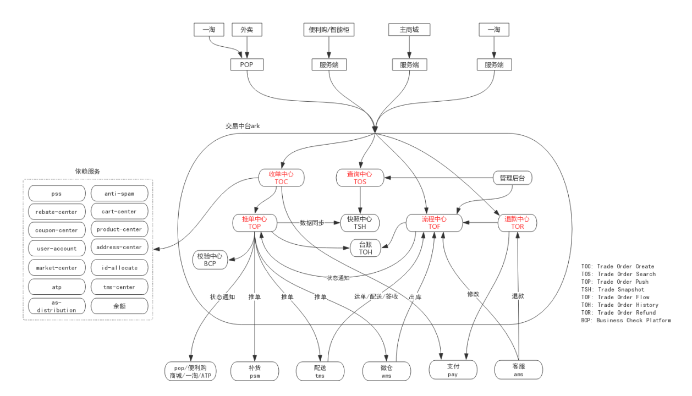

# 1.背景
&emsp;&emsp;
随着笔者公司业务的发展，陆续开展了多业务线，包括：极速达、次日达、厂家直送、便利购、菜场等多条业务线。在各业务线发展初期，为了快速跑通MVP，临时拉团队快速搭建新系统，但这就导致烟囱式系统林立，数据相互割裂，不仅成本高，新业务开发周期还很长等问题。

&emsp;&emsp;
为了解决以上问题，在公司进行战略转型的同时，我们的系统架构也开始迎接中台战略，技术架构从烟囱式系统走向中台架构架构。

# 2.中台建设前面临的问题
- 成本过高
   
    各业务团队都有交易系统，重复造轮子，造成运维成本、研发成本的浪费。

- 数据割裂
    
    各业务团队的订单数据的割裂存储、数据模型的不统一，造成依赖于订单数据的大数据、财务、客服等服务为了适配不同数据模型，冗余了大量的适配逻辑和兼容逻辑，增加了这些系统的复杂度；复杂度的增加，不仅仅是沟通成本、研发成本的增加，也降低了系统稳定性。

- 业务迭代需求响应慢
    
    交易系统功能定制化，抽象性、扩展性、复用性都较差，需求响应慢，影响业务迭代效率。

- 创新业务试错成本高
    
    创新项目不能利用现有交易系统，只能组建临时团队，搭建新的交易系统，拉高了试错成本。而较高的试错成本，会阻碍创新项目启动的机会，延误商机。

    
架构层面，在中台建设以前，交易相关系统虽然也叫"交易中台"，但仅仅是个名字，只支持极速达一种业务。如下图：
  

    
  

  

    
  

# 3.中台的价值
-  降低成本

    收敛各业务团队的烟囱式交易系统，降低运维成本、研发成本。

- 提高效率
    
    高扩展性、高复用性，对内对外大幅提高研发效率。交易平台自身对接新业务需求仅需3天；数据模型的统一，降低大数据、财务等外部关联服务的复杂度，提高的这些关联服务支持新需求的效率。

- 业务赋能 
  
    创新项目可以低成本跑通 MVP，降低试错成本；体现技术驱动业务发展的能力。

- 标杆系统 
  
  交易平台率先完成平台化，对标行业领先；随着交易平台的价值的逐步体现，在公司内部树立标杆形象，促进达成建设平台化架构的共识，引领兄弟部门平台化建设的步伐；最终形成业务中台化，打造全链路的高效、稳定的业务赋能能力。

# 4.中台设计目标
构建一套通用、可配置、易扩展的平台化交易系统，统一支持多业务、多品类的订单交易：

•复用性高：功能一次开发，多业务复用。

•维护成本低：平台统一维护，维护成本由N1。

•数据打通：数据集中管理，天然打通。

# 5.中台建设过程中的难点及挑战
&emsp;&emsp;
不同业务线因售卖的品类不同，交易业务的差异性也较大，如：极速达业务主要售卖生鲜类，走自营配送衍生出不同品类的差异性流程；而便利购则售卖零食类，由C端用户自主完成履约。
- 挑战：
    - 对多业务、多品类的交易功能如何高效、稳定支持？对于不同业务的差异流程如何支持？如何避免不同的业务相互影响？对比不同业务的业务的一些个性数据怎么存储？
- 难点：
    - 中台的通用性&扩展性建设：
        - 业务身份定义：如何区分不同品类、不同业务？
        - 业务模型扩展：如何支持业务交易模型差异？
        - 业务功能通用&扩展：如何统一支持不同业务交易功能及 其差异逻辑？
        - 业务流程扩展：如何支持不同业务差异交易流程？
    -  中台的稳定性建设：
        - 同一系统支持多业务交易，存在相互影响隐患？
        - 线上问题如何快速定位到问题业务？
    -  中台的性能建设：
        - 海量数据怎么存储才能保证读写性能？
        - C端、B端流量如何避免相互影响？
        - 读写流量如何避免相互影响？

# 6.中台架构全景
如下图，分为下面几层：

•基础设施层：提供存储、消息、RPC等中间件。

•基础功能层：按域组织的基础服务，域服务内针对不同业务的差异提供扩展点。

•产品功能层：串联不同域服务形成产品级功能节点，比如下单、支付等。

•业务流程层：对产品功能进行编排，形成业务流程。

•业务层：指定业务身份、扩展点实现及业务流程配置等，实现不同业务差异。

  

    
  

# 7.中台关键技术点解析
## 7.1 业务身份
### 7.1.1业务身份定义
&emsp;&emsp;
作为中台架构，定义业务身份是首要任务。业务身份的定义，是用于区分不同业务、不同品类的差异功能，需要定义一套合理且具有扩展性的业务身份方便业务管理。基于业务场景，我们使用3个维度定义业务身份：
- 业务线：区分不同运营团队所运营的业务，比如主商城、便利购、开放平台等
- 渠道：同一个业务线，有不同的流量渠道，比如便利购业务下有普通柜、智能柜等
- 订单类型：根据商品类型、履约形态的不同，定义不同的订单类型，比如极速达订单、云超订单等

## 7.2 扩展性
### 7.2.1 数据模型扩展
&emsp;&emsp;
订单数据模型，除了通用的买家信息、卖家信息、商品信息、支付信息、买家履约信息(支付信息)、卖家履约信息等基本信息之外，不同业务形态的订单还有差异化的数据需要存储和传递。我们的解决方案是通用信息结构化存储+差异信息JSON存储，具体如下：
- 通用信息：通用信息结构化存储
- 差异信息：服务间传递、存储用JSON格式， 后续处理由业务自定义逻辑处理，与通用逻辑解耦
- 金额类信息：预期到有频繁的扩展需求，金额类型和金额值采用KV结构化存储，提高可扩展性

### 7.2.2 业务功能扩展
&emsp;&emsp;
支持多业务问题本质上是业务功能如何抽象的问题，而差异逻辑处理则是在抽象通用基础能力的基础上，如何在部分处理环节支持差异性逻辑。我们采用的是抽象通用能力+预留扩展点的方式，具体如下：
- 抽象通用能力：调研业务场景，对功能进行统一抽象，形成业务通用能力域，方便多业务复用
- 预留扩展点：在通用能力域中针对可能存在差异地方预留扩展点，方便差异逻辑的实现；差异逻辑可通过配置化解决，也可用差异化代码实现。

### 7.2.3 业务流程扩展
&emsp;&emsp;
差异化流程的本质是串联能力节点形成业务流程，信息可在能力节点之间传递。我们采用流程编排+标准上下文的方式实现，具体如下：
- 流程编排：我们团队自研流程引擎ark-maze组件，进行业务流程编排
- 标准上下文：流程节点之间数据通过上下文传递，定义业务流程通用的上下文结构
- 流程引擎ark-flow-engine组件，以“责任链”模式来组织复杂处理流程的执行过程，保障服务节点能够按照顺序执行，并且能够传递执行结果；发生异常可逆序进行回滚操作；支持节点的串行、并行执行。ark-maze组件架构图如下：

## 7.3 稳定性
### 7.3.1 服务隔离
&emsp;&emsp;
一套系统支持多个业务形态，导致业务间相互影响的原因如下：
- 应用资源相互影响：某业务占用资源过多，影响其它业务
- 存储相互影响：共享存储，导致业务间相互影响 我们采用多级别隔离机制，具体如下：
- 线程池隔离：我们的分布式服务框架采用的是阿里开源框架dubbo，不同业务使用不同的dubbo的group，达到dubbo线程池的隔离，避免多业务争抢线程池的情况。
- 服务器隔离：服务器按业务线分组独立部署，不同业务请求路由到相应的服务器集群。基于业务线配置不同profile文件，服务器按profile分组部署，不同的proflie注册不同group的dubbo服务，dubbo消费者使用不同group的服务。
- 存储隔离：使用分库策略，不同业务数据路由到不同数据库集群。权衡业务流程规模、系统复杂度、运维成本，目前每日优鲜在【线程池隔离】级别。

### 7.3.2 分业务监控
&emsp;&emsp;
多业务监控本质上是在原有监控指标增加业务维度即可，相关监控指标包括：
- 应用指标：异常日志、调用量等；
- 业务指标：下单数、支付数、取消数等；

### 7.3.3 业务保障平台 ark-bcp
&emsp;&emsp;
如何保障多业务正常运行？其本质就是如何快速发现问题，并且具有一定的自动修复的能力。

&emsp;&emsp;
在这里主要是利用我们自研的业务检查保障平台(ark-bcp)平台，实时地发现业务数据的一致性和正确性问题，某些异常场景能做到自动修复，如果不能自动修复，第一时间报警给相关负责人。业务保障平台通过事件触发执行校验规则，规则支持自定义脚本和自定义api接口。

## 7.4 高性能
### 7.4.1 存储高性能
作为交易系统，存储海量订单数据，对外提供高可用、高性能的读写服务是必须要支持的。为了保障高可用、高性能，我们采用如下方案：

- 分库分表：为了解决单库单表的存储上限和并发处理上限的问题，我们在设计初期以当时预估的5年内的订单规模，设计为N个分库N个分表。以订单号后N位取模作为分库分表的路由规则。
- 读写分离：Mysql集群采用1主+1备+N从的高可用架构。写流量走主库，主库配置备库，保障高可用；读流量走从库，有实时性要求的读流量也走主库，由上游应用根据业务场景来决定；B端、C端读流量分离，避免B端流量影响C端用户流量。
- ES搜索引擎：Mysql采用分库分表的方案，导致Mysql不能提供多表联合查询和多维度的复杂查询，采用其他搜索引擎提供复杂查询能力成为必然。我们采用分布式文档数据库Elasticsearch搜索引擎。监听Mysql数据库的binlog实时同步增量异构数据到Elasticsearch。为了保障ES集群的高可用，搭建2套ES集群作为互备，也能做到B端、C端流量的分离；Mysql数据同步ES有秒级的延迟，有实时性要求的C端流量不走ES，只能走Mysql主库查询，例如：待支付订单列表页查询Mysql，而其它实时性要求不高的或者用户无需感知实时状态的订单列表页（如：待配送、配送中的订单列表页）查询ES。

### 7.4.2 流程异步化
&emsp;&emsp;
非核心业务处理如果混杂在核心链路中，会影响核心流程的性能和稳定性。在这里我们把非核心处理剥离出来，异步化处理，提高整体的性能和稳定性。

##7.5 一致性
### 7.5.1 最终一致性事务框架ark-tc
&emsp;&emsp;
在这里我们主要采用自研的ark-tc框架来保证最终的一致性：在我们的核心业务流程中存在发送MQ，发起RPC调用第三方、刷新ES等场景，如：在生单流程中，需要在保存数据库后发送一条MQ消息。而以上这些场景是需要保证一定要执行的。当机器遇到宕机这类故障后，这些任务则有几率不会被执行。为了解决以上问题，通常的做法是每个业务写一个任务表定期执行；但是这样做带来的问题是巨多的任务表，维护和操作也不方便，重复的操作逻辑也会散落在各个业务处理中。我们团队ark-tc框架则是为了解决以上问题而生的，它会把需要执行的任务持久化到数据库中，然后不断的重试补偿动作，直到任务处理成功。
### 7.5.2 对账
&emsp;&emsp;
我们的数据一致性的另一个重要方法则是通过数据对账，及时发现及处理不一致的数据。

# 8.中台建设成果
- 交易平台已支撑十亿+的海量订单数据；
- 能够稳定且高效的支撑公司数十种业务形态；
- 根据新业务的复杂程度，能在<b>1-3天</b>内完成新业务的接入。
  
